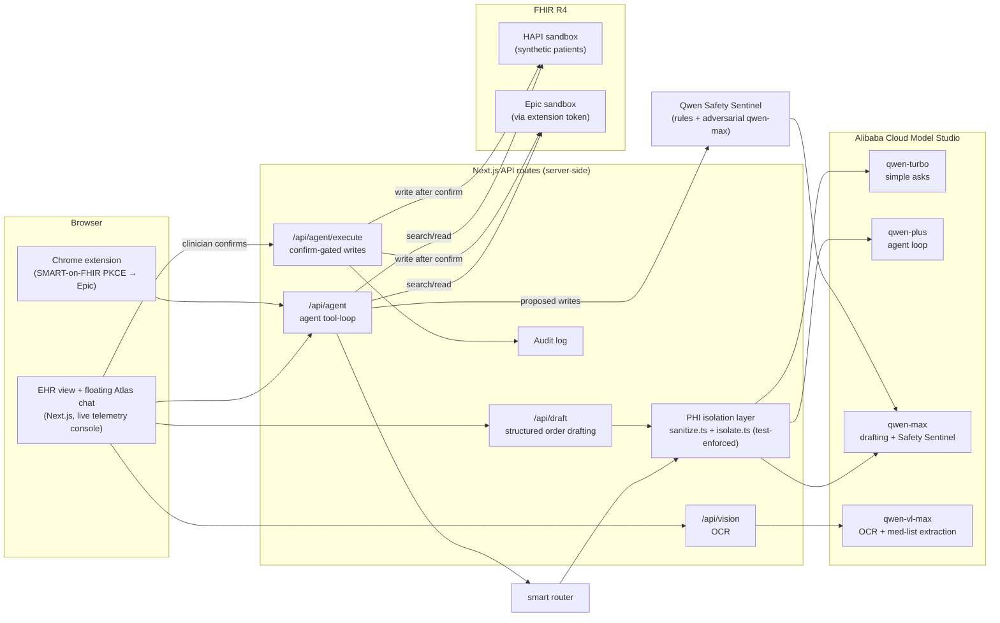

# Atlas: Autonomous EHR Copilot on Qwen

> Say the order. Atlas does the work. You confirm the writes.

**Global AI Hackathon with Qwen Cloud. Track 4: Autopilot Agent.**

**Live demo: https://atlas-qwen.vercel.app** (synthetic patients; zero setup)

Atlas automates a real clinical business workflow end-to-end: a clinician types (or speaks)
plain-English intent, *"order a CBC and start metformin 500mg BID"*, *"any care gaps?"*,
*"summarize this patient"*, and an agentic loop powered by **Qwen on Alibaba Cloud Model
Studio** reads the live FHIR chart, reasons over it, drafts correctly-coded actions
(LOINC / SNOMED / RxNorm), and queues every chart mutation behind a **human-in-the-loop
confirm gate** with a full audit log. The model **never receives raw PHI**: it reasons
only over de-identified, coded data, and that boundary is enforced by tests.

## Why this is an Autopilot Agent (Track 4)

| Track requirement | How Atlas delivers |
|---|---|
| Handles ambiguous inputs | Free-text clinical intent → structured drafts; ambiguous med orders (missing dose) become clarifying questions, never guesses; even a photographed paper med list becomes structured, reconciled proposals (Qwen-VL) |
| Invokes external tools | Agent tool-loop over live FHIR R4 (`search_fhir` / `read_fhir` / `propose_write`) against the HAPI sandbox, plus Epic SMART-on-FHIR via the Chrome extension |
| Human-in-the-loop checkpoints | Every write is proposed, narrated, and executed **only after clinician confirmation**; in-memory audit log records every action |
| Production-readiness | Layered safety: a second-model **Qwen Safety Sentinel** adversarially reviews every proposed write (allergy conflicts, interactions, duplicates) before the clinician sees it; PHI-isolation enforced by tests; typed env validation; retry-hardened FHIR client; live telemetry console; mock-FHIR failover |

## Proof of Alibaba Cloud

All model inference runs on **Alibaba Cloud Model Studio (DashScope)**:

- **[`src/lib/llm/qwen.ts`](src/lib/llm/qwen.ts)**: the single client every model call goes
  through, pointed at `https://dashscope-intl.aliyuncs.com/compatible-mode/v1`.
- [`src/lib/agent/runAgent.ts`](src/lib/agent/runAgent.ts): agentic FHIR tool-loop on **qwen-plus**.
- [`src/lib/agent/draftOrders.ts`](src/lib/agent/draftOrders.ts): forced tool-call structured
  order drafting (+ SSE-streamed narration) on **qwen-max**.
- [`src/app/api/vision/route.ts`](src/app/api/vision/route.ts): OCR + structured med-list extraction on **qwen-vl-max**.
- [`src/lib/llm/router.ts`](src/lib/llm/router.ts): smart model router across **qwen-turbo / qwen-plus / qwen-max** by request complexity.
- [`src/lib/agent/sentinel.ts`](src/lib/agent/sentinel.ts): the **Qwen Safety Sentinel**, an independent qwen-max reviewer that adversarially audits every proposed chart write.

## Architecture



The agent loop: the smart router picks a Qwen tier for the request → preload a PHI-stripped
chart snapshot (5 parallel FHIR searches) → Qwen reasons and calls tools (bounded, 5 rounds
max) → reads auto-execute, **writes only queue** → the Safety Sentinel (deterministic rules
+ an independent adversarial qwen-max review) attaches a verdict to every proposal →
clinician reviews narrated, safety-badged proposals → one click executes and audits them. A live system
console in the UI streams every FHIR op, reasoning round, token count, and latency in real
time. Deeper details: [`docs/architecture.md`](docs/architecture.md).

## Stack

- **Qwen** (qwen-max / qwen-plus / qwen-vl-max) on **Alibaba Cloud Model Studio**, via the
  OpenAI-compatible DashScope endpoint: tool calling, forced function calls, streaming
- **Next.js 16** (App Router) + **Tailwind v4**, API routes only (no DB; in-memory audit)
- **FHIR R4**: public HAPI sandbox (synthetic patients, zero real PHI) + Epic sandbox
  through the Chrome extension's SMART-on-FHIR (PKCE) token

## Setup

```bash
npm install
cp .env.example .env.local   # fill in QWEN_API_KEY
npm run dev                  # http://localhost:3000
```

### Environment (`.env.local`)

| Var | Purpose |
|-----|---------|
| `QWEN_API_KEY` | Alibaba Cloud Model Studio API key (server-side only) |
| `QWEN_BASE_URL` | DashScope endpoint (defaults to the international region) |
| `QWEN_MODEL` | Order drafting, default `qwen-max` |
| `QWEN_AGENT_MODEL` | Agent loop, default `qwen-plus` |
| `QWEN_VL_MODEL` | OCR, default `qwen-vl-max` |
| `FHIR_BASE_URL` | Defaults to `https://hapi.fhir.org/baseR4` |
| `DEMO_PATIENT_ID` | Pinned demo patient |
| `NEXT_PUBLIC_USE_MOCK_FHIR` | `true` → local mock FHIR (demo-safe fallback) |

## Scripts

```bash
npm run dev      # dev server
npm run build    # production build + typecheck
npm run lint     # eslint
npm test         # vitest (incl. the PHI-isolation boundary tests)

# Live drafting success-rate check (hits Qwen on Alibaba Cloud):
QWEN_API_KEY=sk-... npx vitest run draftOrders
```

## Safety model

- **Confirm-before-write**: nothing reaches the chart without an explicit click.
- **PHI isolation**: only coded context (codes, values, banded age) is sent to Qwen;
  names/MRN/DOB stay server-side. Enforced by `src/lib/phi/isolate.test.ts` (6 assertions).
- **No guessed doses**: ambiguous medication orders become clarifying questions.
- **Bounded agency**: the tool-loop is capped at 5 rounds and 5 proposals per turn.
- **Second-model review**: the Qwen Safety Sentinel independently audits every proposed
  write for allergy conflicts, interactions, duplicate therapy, and wrong codes; verdicts
  (pass / warn / block) are shown on each proposal card. Fail-open to "unreviewed", never
  a silent pass, and the human confirm gate always stands.
- **Deterministic rule layer**: allergy and duplicate checks run in code (unit-tested),
  independent of any model.
- **Write-boundary validation**: a structural FHIR validator gates every confirmed write;
  malformed model output is rejected before it can reach the FHIR server.
- **Tamper-evident audit**: the audit log is SHA-256 hash-chained; `/api/audit` returns a
  chain verification, so any mutation or deletion of history is detectable.
- **Resilience**: every Qwen call runs behind timeout + bounded retry with exponential
  backoff + a shared circuit breaker, so upstream trouble degrades gracefully.
- **Cost observability**: per-turn token cost estimates stream into the Live System
  Console next to latency and token counts.

## How Atlas measures against the industry

We benchmarked Atlas against Abridge, Microsoft Dragon Copilot, Ambience, Hippocratic AI,
Navina, Regard, Suki, Glass Health, OpenEvidence, and Epic's native AI. Atlas implements
the patterns those leaders converge on: draft-not-commit, a supervisory model tier
(Hippocratic's "constellation" thesis), task-routed models, per-claim evidence provenance
(Abridge "Linked Evidence" style [Type/id] citations rendered as chips), chart-aware
reasoning, tiered differentials with a can't-miss safety net (Glass), automation-bias
guards, and tamper-evident auditability. Full honest scorecard, including what we
deliberately do NOT claim: [`docs/industry-benchmark.md`](docs/industry-benchmark.md).

## Demo

See [`docs/demo-script.md`](docs/demo-script.md). The web demo runs on synthetic/mock
patients; the Chrome extension connects the same agent to Epic's sandbox via
SMART-on-FHIR.

## License

[MIT](LICENSE)
