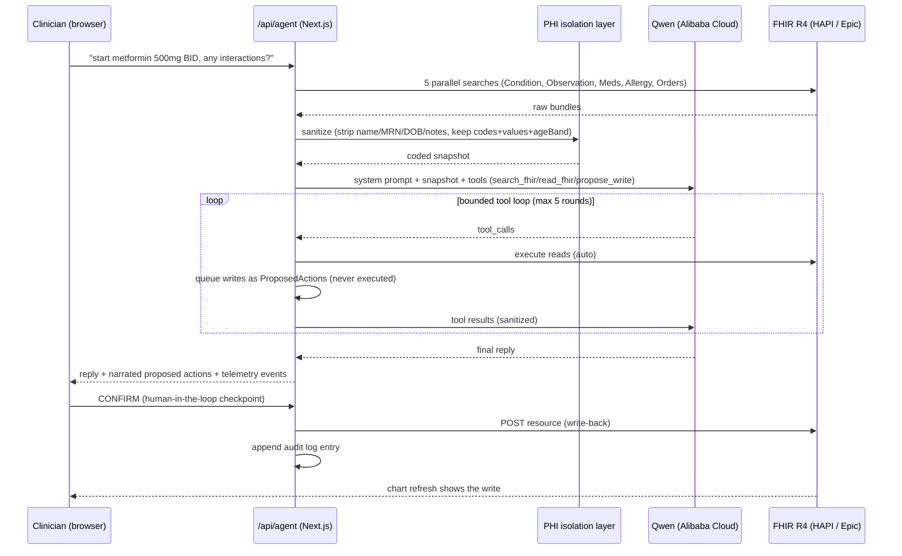

# Atlas Architecture

Atlas is an autonomous EHR copilot: an agentic loop over a live FHIR chart with every
mutation gated behind clinician confirmation. All model inference runs on **Qwen via
Alibaba Cloud Model Studio (DashScope, OpenAI-compatible endpoint)**.

## System overview

## Model routing (all Alibaba Cloud Model Studio)

| Path | Model | Why |
|------|-------|-----|
| Agent loop (`src/lib/agent/runAgent.ts`) | routed: `qwen-turbo` / `qwen-plus` / `qwen-max` | The smart router (`src/lib/llm/router.ts`) classifies each request; simple read-only asks go fast/cheap, complex clinical reasoning (care gaps, interactions, reconciliation) gets the strongest tier. The decision is emitted to the Live System Console |
| Safety Sentinel (`src/lib/agent/sentinel.ts`) | `qwen-max` | Independent adversarial reviewer of every proposed write; a different model instance than the agent, so the author never grades its own homework |
| Order drafting (`src/lib/agent/draftOrders.ts`) | `qwen-max` | Highest-accuracy coded output (LOINC/RxNorm), forced function call |
| OCR + med extraction (`src/app/api/vision/route.ts`) | `qwen-vl-max` | Multimodal transcription and structured medication-list extraction |

Client construction is centralized in [`src/lib/llm/qwen.ts`](../src/lib/llm/qwen.ts):
one OpenAI-compatible client against `https://dashscope-intl.aliyuncs.com/compatible-mode/v1`
(region-overridable via `QWEN_BASE_URL`). Env validation is typed with Zod in
[`src/lib/env.ts`](../src/lib/env.ts); the key never reaches the client bundle.

## The agent loop

1. **Snapshot preload**: 5 parallel FHIR searches, sanitized and truncated to ~9 KB,
   injected into the system prompt. Cuts most turns to 1-2 reasoning rounds.
2. **Bounded tool loop**: max 5 rounds, OpenAI-style `tool_calls`:
   - `search_fhir` / `read_fhir` execute immediately,, results PHI-sanitized before
     re-entering context.
   - `propose_write` **never executes**. The action is queued as a `ProposedAction`
     with a plain-English summary for the clinician.
3. **Confirmation**: the UI renders narrated proposals; `/api/agent/execute` performs
   the write only on explicit confirm, then appends to the audit log.
4. **Safety Sentinel**: when the loop finishes with proposed writes, two independent
   layers review them before the clinician sees anything:
   - a deterministic rule layer (unit-tested, model-free): allergy-name conflicts and
     exact-code duplicate therapy against the chart snapshot;
   - an adversarial `qwen-max` review via forced function call: drug-drug interactions,
     cross-reactivity classes, contraindications vs active problems, implausible doses,
     code/summary mismatches.
   The worse verdict wins (`pass` < `warn` < `block`); reasons are attached to each
   proposal and rendered as badges in the UI. The sentinel fails open to `unreviewed`
   (never a silent pass) and never bypasses the human confirm gate.
5. **Telemetry**: every routing decision, FHIR op, reasoning round (with real token usage
   from `resp.usage`), proposal, and sentinel verdict is emitted as a structured
   `AgentEvent`, streamed into the Live System Console in the UI.

## Structured order drafting

`draftOrders.ts` forces the `submit_orders` function call
(`tool_choice: {type: "function", ...}`) so output is schema-shaped JSON, not free text.
The streaming variant streams the `narration` field (first in the schema, so it arrives
first in the argument stream) over SSE for perceived speed, then returns the complete
drafts. A tolerant parser falls back to extracting JSON from text content if the model
ever skips the tool call.

## Multimodal med reconciliation

A photo of the patient's home medication list (pill bottles, handwriting, printouts) is
sent to `qwen-vl-max` in structured mode, which returns
`{medications: [{name, dose, frequency}]}`. The extracted list is fed to the agent as a
reconciliation request, so the proposals flow through the exact same pipeline as typed
input: bounded tool loop, then Safety Sentinel, then clinician confirm, then audit. One
button in the chat input triggers the whole chain.

## PHI isolation (production-readiness core)

The model reasons **only over coded, de-identified data**:

- `src/lib/phi/isolate.ts` builds `ModelContext`: codes, values, banded age, sex. No
  name, MRN, DOB, address, or free-text notes.
- `src/lib/agent/sanitize.ts` strips identifiers from every FHIR resource/bundle before
  it enters model context.
- `src/lib/phi/isolate.test.ts` is the enforcement gate (6 assertions): CI-red if PHI
  could reach the model payload.

## Failure handling

- FHIR client retries transient failures; agent tool errors are fed back to the model as
  tool results (it recovers or reports).
- Mock-FHIR failover (`NEXT_PUBLIC_USE_MOCK_FHIR=true`) keeps the demo alive if the
  public sandbox is down.
- Epic sandbox write restrictions (ServiceRequest/MedicationRequest creation is
  production-gated) are handled gracefully: the agent reports what it could not write.

## Provenance

Atlas began as an EHR-copilot hackathon project on a different model provider; for the
Global AI Hackathon with Qwen Cloud the entire model layer was ported to Qwen on Alibaba
Cloud Model Studio (agent loop, forced-function drafting, streaming, and OCR; the OCR
path replaced a former Azure Document Intelligence dependency entirely).
