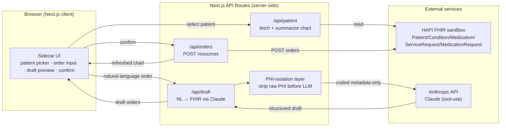

# PRD — Atlas

## 1. Overview

### Product Summary
**Atlas** — Atlas turns a clinician's plain-English intent into structured, coded orders inside any FHIR EHR. It is a browser sidecar that sits alongside an EHR, reads the open patient's chart from FHIR, drafts correctly-coded orders (labs, imaging, medications) from natural language, narrates each one in plain English, and writes them back to the chart only after a single confirming click. The AI reasons over coded metadata and never receives raw PHI.

### Objective
This PRD covers the **hackathon MVP** as scoped in `product-vision.md` § Product Strategy > MVP Definition: the end-to-end magic-moment loop (read patient context → natural-language order input → NL→FHIR drafting → narrate + confirm → write-back) plus the PHI-isolation boundary. It explicitly excludes real OAuth, a persistent database, and broad order vocabulary (see § 14).

### Market Differentiation
Native EHR order entry is comprehensive but slow; ambient scribes are fast but only document. Atlas is the tool that *acts on the chart* — turning intent into confirmable, coded FHIR orders and writing them back. Technically, this means the implementation must nail three things: (1) a reliable NL→FHIR mapping that emits valid, correctly-coded resources, (2) a write-back path that proves the loop closes, and (3) a server-side PHI-isolation boundary that's real and testable. Build on FHIR resources only, so "works with any FHIR EHR" holds.

### Magic Moment
Clinician selects a patient, types *"order a CBC and a chest X-ray, and start metformin 500mg BID,"* Atlas drafts three correctly-coded FHIR orders with a plain-English summary, clinician clicks Confirm once, orders write back and appear in the chart — in seconds, with no raw PHI sent to the model. **Must be fast:** the draft step (stream narration, target < 8s). **Must be seamless:** confirm → write → chart refresh with no page reload. **Must work perfectly:** correct codes for the demo vocabulary; zero unconfirmed writes.

### Success Criteria
- End-to-end magic-moment success rate ≥ 90% on the curated demo vocabulary (target 100%).
- Time from submitted sentence to confirmed write-back < 10s.
- **Zero** orders written without explicit confirmation.
- **Zero** raw-PHI-to-model events (enforced by automated test).
- Draft preview is keyboard-operable and screen-reader labeled.
- App runs locally with a single `npm run dev` and a documented `.env.local`.

-----

## 2. Technical Architecture

### Architecture Overview


### Chosen Stack
| Layer | Choice | Rationale |
|---|---|---|
| Frontend | Next.js (App Router) | Best AI-coding-tool support, server-side API routes for safe proxying, fast Vercel deploy, team has Next.js experience |
| Backend | Next.js API routes | Server-side route handlers proxy Anthropic + FHIR so keys never reach the browser; fewest moving parts for a hackathon |
| Database | None | No persistent DB for the hackathon; in-memory audit log only. Real immutable audit store is a production next step |
| Auth | None (mocked SMART-on-FHIR) | No real accounts; mocked login + patient picker stands in for EHR launch context. Real SMART OAuth is a documented next step |
| Payments | None | Monetization deferred (revenue model: free) |

### Stack Integration Guide
**Setup order:**
1. Scaffold Next.js (App Router, TypeScript, Tailwind): `npx create-next-app@latest atlas --ts --tailwind --app --eslint`.
2. Add the Anthropic SDK (`@anthropic-ai/sdk`) and a FHIR helper approach — use a thin typed `fetch` wrapper against the HAPI base URL (the `@types/fhir` package gives FHIR R4 TypeScript types; optionally `fhir-kit-client` for convenience, but plain `fetch` is enough and has fewer surprises in a hackathon).
3. Configure design tokens in `tailwind.config.ts` and `globals.css` from `product-vision.md` § Design Tokens.
4. Build the server routes (`/api/patient`, `/api/draft`, `/api/orders`) before the UI, so the UI wires to real endpoints.
5. Build the sidecar UI and the demo "EHR" two-pane shell.

**Known patterns / gotchas:**
- **All Anthropic and FHIR write calls go through API routes**, never the client — the Anthropic key and any future FHIR credentials stay server-side.
- **HAPI public sandbox** (`https://hapi.fhir.org/baseR4`) is open and supports read + `POST`. It's shared and occasionally slow/cleaned — cache the demo patient ID and have the local mock fallback (see § Open Questions).
- **FHIR R4 resource shapes matter:** a `MedicationRequest` needs `status`, `intent`, `subject` (patient reference), and a `medicationCodeableConcept`; a `ServiceRequest` needs `status`, `intent`, `subject`, and a `code`. Validate before POST.
- **Streaming:** use the Anthropic streaming API to stream narration into the UI for perceived speed.
- **Tool-use for structured output:** define a Claude tool whose input schema is the draft-orders shape; this forces valid structured output instead of parsing free text.

**Required environment variables (`.env.local`):**
```
ANTHROPIC_API_KEY=sk-ant-...
ANTHROPIC_MODEL=claude-sonnet-4-6   # fast + strong tool-use for the demo; opus for hardest mapping
FHIR_BASE_URL=https://hapi.fhir.org/baseR4
DEMO_PATIENT_ID=                    # set after seeding/identifying a synthetic patient
NEXT_PUBLIC_USE_MOCK_FHIR=false     # flip to true to use the local mock fallback
```

### Repository Structure
```
atlas/
├── src/
│   ├── app/
│   │   ├── page.tsx                 # Demo "EHR" two-pane shell (chart + sidecar)
│   │   ├── login/page.tsx           # Mocked SMART-on-FHIR login screen
│   │   ├── layout.tsx               # Root layout, fonts, globals
│   │   ├── globals.css              # CSS variables / design tokens
│   │   └── api/
│   │       ├── patient/route.ts     # GET patient context (chart summary)
│   │       ├── draft/route.ts       # POST natural-language → draft FHIR orders
│   │       └── orders/route.ts      # POST confirmed orders → FHIR write-back
│   ├── components/
│   │   ├── ui/                      # Button, Input, Card, Badge, Skeleton (design system)
│   │   └── features/
│   │       ├── PatientPicker.tsx
│   │       ├── ChartSummary.tsx
│   │       ├── OrderInput.tsx
│   │       ├── DraftOrderCard.tsx   # one drafted order + codes
│   │       ├── ConfirmPanel.tsx     # the hero confirm/reject UI
│   │       └── AuditLog.tsx
│   ├── lib/
│   │   ├── fhir/
│   │   │   ├── client.ts            # typed fetch wrapper for FHIR base URL
│   │   │   ├── read.ts              # read Patient/Condition/MedicationStatement/AllergyIntolerance
│   │   │   ├── write.ts             # build + POST ServiceRequest/MedicationRequest
│   │   │   └── types.ts            # narrowed FHIR R4 types used here
│   │   ├── agent/
│   │   │   ├── draftOrders.ts       # Claude call with tool-use; returns draft orders
│   │   │   ├── tools.ts             # tool schema for structured draft output
│   │   │   └── prompt.ts            # system prompt (coded-metadata only)
│   │   ├── phi/
│   │   │   ├── isolate.ts           # build the coded-only context sent to the model
│   │   │   └── isolate.test.ts      # asserts no raw PHI leaves to the model
│   │   ├── codes/
│   │   │   └── vocabulary.ts        # curated LOINC/RxNorm map for the demo set
│   │   └── audit/
│   │       └── log.ts               # in-memory audit log (drafted/confirmed/rejected)
│   └── mock/
│       └── fhirServer.ts            # optional local mock FHIR fallback
├── public/
├── .env.local                       # not committed
├── tailwind.config.ts
└── package.json
```

### Infrastructure & Deployment
- **Local-first for the hackathon:** `npm run dev`. This is what you demo from to avoid cold-starts and network surprises.
- **Optional deploy:** Vercel (`vercel`), set the same env vars in the Vercel dashboard. Keep `ANTHROPIC_API_KEY` server-only (no `NEXT_PUBLIC_` prefix).
- **No CI/CD required** for the hackathon beyond running the test suite locally (the PHI-isolation test should be in `npm test`).

### Security Considerations
- **No auth** (mocked). Do not store any real credentials. The mocked login sets a client-side flag only.
- **PHI isolation is the core security property:** `lib/phi/isolate.ts` constructs the context object sent to Claude using only coded/structured fields (codes, categories, flags) — never names, MRNs, DOBs, or free-text identifiers. The accompanying test asserts the outbound payload contains no raw-PHI fields.
- **Keys server-side only:** Anthropic key accessed only in API routes.
- **Input validation:** validate the natural-language request length and the drafted FHIR resources (required fields present, codes from the curated vocabulary) before any write. Use `zod` schemas at the API boundary.
- **Write safety:** the `/api/orders` route accepts only resources that match the draft the user confirmed (re-validate server-side); never write arbitrary client-supplied FHIR.

### Cost Estimate (first 6 months, < 1000 users)
- **HAPI FHIR public sandbox:** $0 (free, shared).
- **Anthropic API:** demo + light pilot usage — roughly $5–40/month depending on traffic and model (Sonnet for most, Opus for hardest mappings). Each draft is a small prompt + structured output.
- **Vercel:** $0 on Hobby for a demo; $20/month Pro if needed.
- **Total:** effectively $0 for the hackathon; ~$25–60/month for a light pilot.

-----

## 3. Data Model

> No database in the MVP. "Entities" are (a) FHIR resources read/written against the sandbox and (b) in-memory app types. Definitions below are implementation-ready TypeScript shapes.

### Entity Definitions

**PatientContext (in-memory, built from FHIR reads — coded/safe for display; the model-bound subset is built separately by `lib/phi/isolate.ts`):**
```typescript
// Display context (UI only — may include name for the clinician's screen)
interface PatientContext {
  id: string;                       // FHIR Patient.id
  displayName: string;              // shown in UI only, NEVER sent to the model
  age?: number;                     // derived; safe-ish, still excluded from model payload
  sex?: string;
  problems: CodedItem[];            // from Condition
  medications: CodedItem[];         // from MedicationStatement/MedicationRequest
  allergies: CodedItem[];           // from AllergyIntolerance
}

interface CodedItem {
  code: string;                     // e.g. RxNorm / SNOMED / LOINC code
  system: string;                   // code system URI
  display: string;                  // human label (coded, not PHI)
}
```

**ModelContext (the ONLY thing sent to Claude — no raw PHI):**
```typescript
interface ModelContext {
  patientRef: string;               // opaque reference id (e.g. "Patient/123"), no name/MRN
  ageBand?: string;                 // e.g. "40-49" (banded, not exact DOB)
  sex?: string;
  problems: CodedItem[];
  activeMedications: CodedItem[];
  allergies: CodedItem[];
}
```

**DraftOrder (Claude tool output, pre-confirmation):**
```typescript
interface DraftOrder {
  kind: "lab" | "imaging" | "medication";
  display: string;                  // plain-English summary, e.g. "CBC with differential"
  fhirResourceType: "ServiceRequest" | "MedicationRequest";
  code: { system: string; code: string; display: string };  // LOINC or RxNorm
  // medication-only fields:
  dose?: string;                    // e.g. "500 mg"
  route?: string;                   // e.g. "oral"
  frequency?: string;               // e.g. "twice daily (BID)"
  needsClarification?: string;      // if set, this is a QUESTION, not a draftable order
}
```

**AuditEntry (in-memory log):**
```typescript
interface AuditEntry {
  at: number;                       // Unix ms (server time)
  patientRef: string;
  action: "drafted" | "confirmed" | "rejected" | "write_failed";
  orderSummaries: string[];         // plain-English, coded
}
```

### Relationships
- `PatientContext` 1:1 with a FHIR `Patient`. Its `problems`/`medications`/`allergies` are 1:many reads from `Condition`/`MedicationStatement`/`AllergyIntolerance`.
- `ModelContext` is a derived, PHI-stripped projection of `PatientContext` (built by `lib/phi/isolate.ts`).
- `DraftOrder` 1:1 with a FHIR resource to be written (`ServiceRequest` for lab/imaging, `MedicationRequest` for medication).
- `AuditEntry` references a patient by opaque `patientRef` only.

### Indexes
- N/A (no database). For the in-memory audit log, keep an array keyed by insertion order; cap length (e.g. last 100) to avoid unbounded growth in a long demo session.

-----

## 4. API Specification

### API Design Philosophy
REST-style Next.js Route Handlers under `/api`. JSON in/out. Auth not required (mocked app). Error format is consistent: `{ "error": string, "details"?: unknown }`. No pagination needed (single patient, small order sets). All FHIR and LLM access happens here, server-side.

### Endpoints

```
GET /api/patient?id={patientId}
Purpose: Fetch and summarize a synthetic patient's chart from FHIR.
Auth: none
Response 200: {
  context: PatientContext        // display context (includes displayName for UI)
}
Response 404: { error: "Patient not found" }
Response 502: { error: "FHIR read failed", details?: string }
```

```
GET /api/patients            (optional, for the patient picker)
Purpose: List a few synthetic patients from the sandbox for selection.
Auth: none
Response 200: { patients: { id: string, displayName: string }[] }
```

```
POST /api/draft
Purpose: Turn a natural-language order request into draft FHIR orders (no write).
Auth: none
Body: { patientId: string, text: string }
Behavior: builds ModelContext via lib/phi/isolate (PHI-stripped), calls Claude with
          tool-use, returns structured draft orders. May stream narration.
Response 200: {
  drafts: DraftOrder[],          // some may carry needsClarification instead of a code
  narration: string              // plain-English summary of what will happen
}
Response 400: { error: "Empty or invalid request", details?: ZodIssue[] }
Response 422: { error: "Could not map request to known orders", details?: string }
Response 502: { error: "Model call failed", details?: string }
```

```
POST /api/orders
Purpose: Write CONFIRMED orders back to FHIR.
Auth: none
Body: { patientId: string, drafts: DraftOrder[] }   // only drafts the user confirmed
Behavior: server re-validates each draft (required fields, code in curated vocabulary),
          builds FHIR ServiceRequest/MedicationRequest, POSTs to FHIR, logs audit entries,
          re-fetches the updated chart.
Response 201: {
  written: { resourceType: string, id: string, display: string }[],
  context: PatientContext        // refreshed chart
}
Response 400: { error: "Validation failed", details?: ZodIssue[] }
Response 409: { error: "Drafts do not match a known confirmable shape" }
Response 502: { error: "FHIR write failed", details?: string, partial?: written[] }
```

```
GET /api/audit          (optional, for the AuditLog component)
Purpose: Return the in-memory audit log for the current session.
Response 200: { entries: AuditEntry[] }
```

-----

## 5. User Stories

### Epic: Patient Context
**US-001: Select a patient**
As Dr. Patel, I want to pick a patient so that Atlas works against the right chart.
Acceptance Criteria:
- [ ] Given the app is open, when I open the patient picker, then I see a small list of synthetic patients.
- [ ] Given I select a patient, when the chart loads, then I see demographics, problems, active meds, and allergies pulled from FHIR.
- [ ] Edge case: FHIR read fails → I see a clear error and nothing is fabricated.

### Epic: Natural-Language Ordering
**US-002: Place an order set in plain English**
As Dr. Patel, I want to type "order a CBC and a chest X-ray, and start metformin 500mg BID" so that I don't have to dive through menus.
Acceptance Criteria:
- [ ] Given a patient is selected, when I submit the text, then Atlas shows draft orders with plain-English summaries within a few seconds.
- [ ] Given the drafts, when I review them, then each shows the order and its codes are available on demand.
- [ ] Edge case: an unrecognized order → Atlas tells me it couldn't map it rather than inventing one.

**US-003: Confirm before anything is written**
As Dr. Patel, I want to confirm the drafted orders so that nothing reaches the chart without my approval.
Acceptance Criteria:
- [ ] Given draft orders, when I click Confirm, then the orders are written and appear in the chart.
- [ ] Given draft orders, when I do nothing, then nothing is written.
- [ ] Edge case: write fails → I'm told clearly, and the audit log records a write failure.

**US-004: Reject or edit a draft**
As Dr. Patel, I want to reject a wrong draft so that I stay in control.
Acceptance Criteria:
- [ ] Given a draft I didn't intend, when I click Reject, then nothing is written and it's logged as rejected.

**US-005: Resolve an ambiguous order**
As Dr. Patel, I want Atlas to ask when an order is ambiguous so that it never guesses a dose.
Acceptance Criteria:
- [ ] Given "start metformin" with no dose, when Atlas processes it, then it asks for dose/frequency instead of drafting.
- [ ] Given I answer, when I resubmit, then it drafts the now-complete order.

### Epic: Trust & Safety
**US-006: Know my patient's data isn't going to the model**
As Dr. Shah (CMIO), I want assurance raw PHI never reaches the LLM so that I can trust the tool.
Acceptance Criteria:
- [ ] Given any order request, when Atlas calls the model, then the outbound payload contains only coded metadata (verified by an automated test).
- [ ] Given the demo, when I ask "what does the AI see?", then the team can show the exact PHI-stripped payload.

-----

## 6. Functional Requirements

**FR-001: FHIR patient read**
Priority: P0
Description: Read a synthetic patient's `Patient`, `Condition`, `MedicationStatement`/`MedicationRequest`, and `AllergyIntolerance` from the configured FHIR base URL and assemble a `PatientContext`.
Acceptance Criteria:
- Returns coded problems/meds/allergies with display labels.
- Handles missing resource categories gracefully (empty arrays, not errors).
Related Stories: US-001

**FR-002: PHI-isolation layer**
Priority: P0
Description: Build `ModelContext` from `PatientContext` containing only coded/banded fields; never names, MRNs, exact DOBs, or free-text identifiers. Provide an automated test asserting the outbound model payload has no raw-PHI fields.
Acceptance Criteria:
- `lib/phi/isolate.ts` strips/omits all raw identifiers.
- `isolate.test.ts` fails if a raw-PHI field appears in the model payload.
Related Stories: US-006

**FR-003: NL→FHIR order drafting**
Priority: P0
Description: Call Claude with tool-use to map the clinician's natural-language request + `ModelContext` into `DraftOrder[]` with correct LOINC (labs/imaging) / RxNorm (meds) codes drawn from the curated demo vocabulary.
Acceptance Criteria:
- Valid order text yields structured drafts with correct codes for the demo set.
- Unmappable text yields a clear "couldn't map" result, not a fabricated order.
Related Stories: US-002

**FR-004: Ambiguity → clarifying question**
Priority: P0
Description: When required fields (e.g. medication dose/route/frequency) are missing, the corresponding `DraftOrder` carries `needsClarification` (a question) instead of being draftable.
Acceptance Criteria:
- "start metformin" (no dose) produces a clarification, never a guessed dose.
Related Stories: US-005

**FR-005: Narrate + confirm UI**
Priority: P0
Description: Render each draft with a plain-English summary and on-demand codes; provide a prominent Confirm and a non-alarming Reject. Nothing is written before Confirm.
Acceptance Criteria:
- Confirm writes; Reject/no-action writes nothing.
- Confirm panel is keyboard-operable and screen-reader labeled (names patient + orders).
Related Stories: US-003, US-004

**FR-006: Order write-back + chart refresh**
Priority: P0
Description: On confirm, server re-validates drafts, builds and POSTs FHIR resources, then re-fetches and returns the updated chart.
Acceptance Criteria:
- Confirmed orders appear in the chart after write.
- Server rejects drafts that don't match a confirmable shape (409).
Related Stories: US-003

**FR-007: In-memory audit log**
Priority: P1
Description: Record drafted/confirmed/rejected/write_failed actions with coded summaries and timestamps; expose via `/api/audit` and an `AuditLog` component.
Acceptance Criteria:
- Each confirm/reject/failure appends an entry; log is viewable in the UI.
Related Stories: US-003, US-004

**FR-008: Patient picker**
Priority: P1
Description: List a few synthetic patients for selection (vs hardcoded demo patient).
Acceptance Criteria:
- Selecting a patient loads their chart.
Related Stories: US-001

**FR-009: Mocked SMART-on-FHIR login**
Priority: P1
Description: A login screen that resembles a SMART launch and sets a client-side "authenticated" flag; clearly a stand-in.
Acceptance Criteria:
- Login routes to the app; no real credentials are stored.
Related Stories: US-001

**FR-010: Streamed narration**
Priority: P2
Description: Stream the drafting narration into the UI for perceived speed.
Acceptance Criteria:
- Narration appears progressively rather than after a full wait.
Related Stories: US-002

**FR-011: Voice input**
Priority: P2
Description: Optional speech-to-text into the order input box (Web Speech API).
Acceptance Criteria:
- Spoken order populates the input; everything downstream is unchanged.
Related Stories: US-002

-----

## 7. Non-Functional Requirements

### Performance
- Draft response (submit → first narration token) < 2s; full draft < 8s (p90) on the demo vocabulary.
- Confirm → chart-refresh round trip < 3s (p90), network permitting.
- Initial JS bundle < 250KB gzipped.

### Security
- No raw PHI in any LLM prompt (automated test, FR-002).
- Anthropic key server-side only; never shipped to the client.
- Input validated with `zod` at every API boundary; `/api/orders` re-validates confirmed drafts server-side.
- OWASP basics: no eval of model output, no arbitrary FHIR write from client, sanitize displayed strings.

### Accessibility
- WCAG 2.1 AA. Contrast ratios per `product-vision.md` § Color Palette (verified for teal on white/canvas).
- Fully keyboard navigable; visible focus rings; Confirm requires focused-panel intent (no global accidental Enter-confirm).
- Confirm/Reject have aria-labels naming the patient and orders; narration is the accessible description of each draft.
- `prefers-reduced-motion` respected.

### Scalability
- Demo/pilot scale only (< 1000 users). HAPI sandbox and a single Next.js instance suffice. Note: in-memory audit log and any module-level state is per-instance and resets on redeploy — acceptable for the hackathon, flagged for production.

### Reliability
- Graceful degradation: if FHIR read fails, show an error and allow retry; never fabricate chart data.
- If a write partially fails, report which orders were written (`partial`) and log a `write_failed` entry.
- Local mock FHIR fallback (`NEXT_PUBLIC_USE_MOCK_FHIR=true`) so the demo survives sandbox outages.

-----

## 8. UI/UX Requirements

### Screen: Mocked Login
Route: `/login`
Purpose: Stand-in SMART-on-FHIR launch; sets authenticated flag.
Layout: Centered card on `--color-background`; Atlas wordmark, a "Launch from EHR (demo)" primary button, small honest caption "Demo login — real SMART-on-FHIR OAuth is a production step."
States:
- **Default:** card with launch button.
- **Loading:** button shows spinner on click.
- **Error:** inline message if navigation fails.
Key Interactions:
- Click launch → set flag → route to `/`.
Components Used: Card, Button.

### Screen: EHR Workspace (home)
Route: `/`
Purpose: The two-pane "inside the EHR" demo — chart on the left, Atlas sidecar on the right.
Layout: Left pane = `ChartSummary` (demographics, problems, meds, allergies, and a live Orders list). Right pane = fixed 380–420px `Sidecar` containing `PatientPicker` (top), `OrderInput`, draft area (`DraftOrderCard`s + `ConfirmPanel`), and `AuditLog` (collapsible). Below md, sidecar becomes a full-width bottom sheet.
States:
- **Empty (no patient):** chart pane shows "Select a patient to begin"; order input disabled.
- **Loading (chart):** skeleton rows in the chart pane.
- **Populated:** full chart + enabled order input.
- **Error:** chart pane shows retryable error.
Key Interactions:
- Select patient → chart loads (GET /api/patient).
- Submit order text → drafts appear (POST /api/draft), narration streams.
- Confirm → orders write (POST /api/orders), chart Orders list refreshes with a brief success highlight.
- Reject → drafts clear, nothing written.
Components Used: PatientPicker, ChartSummary, OrderInput, DraftOrderCard, ConfirmPanel, AuditLog, Skeleton, Badge.

### Component: OrderInput
Purpose: Capture natural-language order text.
States: idle, focused, submitting (disabled + inline "Atlas is drafting…"), error.
Interactions: Enter submits (Shift+Enter newline); optional mic button (P2) toggles voice.

### Component: DraftOrderCard
Purpose: Show one drafted order.
Layout: kind icon (vial/scan/pill via lucide), plain-English `display`, a "show codes" toggle revealing `system`/`code` in mono font, and for meds the dose/route/frequency. If `needsClarification`, render as a warning-colored question with an inline answer field instead of a confirmable order.
States: draftable, needs-clarification, rejected (faded).

### Component: ConfirmPanel (the hero)
Purpose: The single most prominent UI — summarizes all confirmable drafts and offers one Confirm.
Layout: lifted card (`--shadow-md`), plain-English summary line ("Ready to place 3 orders for {patient}: …"), prominent teal Confirm button, subdued outline Reject. Disabled while any draft needs clarification.
States: ready, blocked (clarification pending), writing (spinner), success (collapses to "Done — N orders placed"), error.
Accessibility: aria-label naming patient + orders; Confirm operable by keyboard only when panel focused.

### Component: ChartSummary
Purpose: Show the (synthetic) patient's chart and a live Orders list.
States: empty, loading (skeleton), populated, error. New orders post-write get a 1.5s success highlight (respecting reduced-motion).

### Component: AuditLog
Purpose: Collapsible list of drafted/confirmed/rejected/failed actions with timestamps — doubles as the "trust" exhibit in the demo.

-----

## 9. Design System

### Color Tokens
```css
:root {
  --color-primary: #0F766E;
  --color-primary-hover: #0E6B63;
  --color-primary-subtle: #CCFBF1;
  --color-secondary: #334155;
  --color-background: #F8FAFC;
  --color-surface: #FFFFFF;
  --color-surface-alt: #F1F5F9;
  --color-text: #0F172A;
  --color-text-muted: #64748B;
  --color-border: #E2E8F0;
  --color-success: #15803D;
  --color-warning: #B45309;
  --color-error: #B91C1C;
  --color-info: #0E7490;
}
```

### Typography Tokens
```css
@import url('https://fonts.googleapis.com/css2?family=Inter:wght@400;500;600;700&family=JetBrains+Mono:wght@400;500&display=swap');
/* Fraunces is imported ONLY on marketing pages, never in the clinical app. */

:root {
  --font-heading: 'Inter', sans-serif;
  --font-body: 'Inter', sans-serif;
  --font-mono: 'JetBrains Mono', monospace;
  --text-xs: 0.75rem;
  --text-sm: 0.875rem;
  --text-base: 1rem;
  --text-lg: 1.125rem;
  --text-xl: 1.25rem;
  --text-2xl: 1.5rem;
  --text-3xl: 1.875rem;
  --leading-body: 1.6;
  --leading-heading: 1.25;
  --leading-data: 1.45;
}
```

### Spacing Tokens
```css
:root {
  --space-1: 4px;  --space-2: 8px;  --space-3: 12px; --space-4: 16px;
  --space-6: 24px; --space-8: 32px; --space-12: 48px; --space-16: 64px; --space-24: 96px;
  --radius-sm: 6px; --radius-md: 8px; --radius-lg: 12px;
  --shadow-sm: 0 1px 2px rgba(15,23,42,0.06);
  --shadow-md: 0 4px 12px rgba(15,23,42,0.10);
  --transition-base: 150ms cubic-bezier(0.4,0,0.2,1);
}
```

### Component Specifications
- **Button:** radius `--radius-md`; primary = solid `--color-primary` / white text / weight 600 / hover `--color-primary-hover`; secondary = 1px `--color-secondary` outline on surface; destructive (Reject) = 1px `--color-error` outline (never solid). Sizes: sm (32px), md (40px), lg (44px). Min touch target 44px on the confirm action.
- **Input:** min-height 44px; 1px `--color-border`; focus = 2px `--color-primary` ring; mono font for code fields.
- **Card:** `--color-surface`, 1px `--color-border`, radius `--radius-lg`, padding `--space-4`, `--shadow-sm`. ConfirmPanel uses `--shadow-md`.
- **Badge (codes/status):** `--color-primary-subtle` bg with `--color-primary` text for codes; semantic colors for status (success/warning/error).
- **Skeleton:** `--color-surface-alt` shimmer (disabled under reduced-motion).

### Tailwind Configuration
```typescript
// tailwind.config.ts
import type { Config } from "tailwindcss";

const config: Config = {
  content: ["./src/**/*.{ts,tsx}"],
  theme: {
    extend: {
      colors: {
        primary: { DEFAULT: "#0F766E", hover: "#0E6B63", subtle: "#CCFBF1" },
        secondary: "#334155",
        background: "#F8FAFC",
        surface: { DEFAULT: "#FFFFFF", alt: "#F1F5F9" },
        text: { DEFAULT: "#0F172A", muted: "#64748B" },
        border: "#E2E8F0",
        success: "#15803D",
        warning: "#B45309",
        error: "#B91C1C",
        info: "#0E7490",
      },
      fontFamily: {
        heading: ["Inter", "sans-serif"],
        body: ["Inter", "sans-serif"],
        mono: ["JetBrains Mono", "monospace"],
      },
      borderRadius: { sm: "6px", md: "8px", lg: "12px" },
      boxShadow: {
        sm: "0 1px 2px rgba(15,23,42,0.06)",
        md: "0 4px 12px rgba(15,23,42,0.10)",
      },
      spacing: { "18": "72px" },
    },
  },
  plugins: [],
};
export default config;
```

-----

## 10. Auth Implementation
This app does not require real authentication. A **mocked SMART-on-FHIR login** (`/login`, FR-009) sets a client-side flag to simulate an EHR launch and routes into the app; no credentials are stored. If real auth is added later, implement the SMART-on-FHIR OAuth2 authorization-code flow (`launch`/`patient` scopes), exchange the code server-side, store the access token in an HTTP-only session, and read patient context from the launch token instead of the picker. Revisit this section when moving to a real pilot.

-----

## 11. Payment Integration
Not applicable. The revenue model is "free (figure it out later)" and there is no payment provider. Skip entirely. If monetization is added later (likely per-seat subscription per `product-vision.md` messaging), revisit with a web payment provider (e.g. Polar or Stripe).

-----

## 12. Edge Cases & Error Handling

### Feature: Patient context
| Scenario | Expected Behavior | Priority |
|---|---|---|
| FHIR read fails / times out | Show retryable error in chart pane; do not fabricate data | P0 |
| Patient has no problems/meds/allergies | Show "None recorded" per section; ordering still works | P1 |
| Sandbox patient was cleaned up | Fall back to mock FHIR or another seeded patient; surface a notice | P1 |

### Feature: Drafting
| Scenario | Expected Behavior | Priority |
|---|---|---|
| Order text unmappable to vocabulary | Return "couldn't map this order" clearly; never invent a code | P0 |
| Missing dose/route/frequency | Return clarifying question (FR-004); block confirm until resolved | P0 |
| Model call fails / rate-limited | 502 with retry; UI shows "Atlas couldn't draft — retry" | P0 |
| Model returns malformed structure | Tool-use schema + server validation rejects; ask user to rephrase | P0 |
| Very long input | Validate length; ask to shorten | P2 |

### Feature: Write-back
| Scenario | Expected Behavior | Priority |
|---|---|---|
| Confirm clicked, FHIR write fails | Report failure; log write_failed; nothing silently dropped | P0 |
| Partial write (some succeed) | Return `partial`; show which placed, which failed | P1 |
| Drafts tampered client-side | Server re-validation rejects (409); never write unconfirmed shapes | P0 |
| Double-confirm (rapid clicks) | Disable Confirm during write; idempotent guard | P1 |

### Feature: PHI isolation
| Scenario | Expected Behavior | Priority |
|---|---|---|
| A new field would carry raw PHI to model | `isolate.test.ts` fails the build | P0 |
| Display name needed in UI | Use display context client-side only; never include in model payload | P0 |

-----

## 13. Dependencies & Integrations

### Core Dependencies
```json
{
  "next": "latest",
  "react": "latest",
  "react-dom": "latest",
  "@anthropic-ai/sdk": "latest",
  "zod": "latest",
  "lucide-react": "latest",
  "clsx": "latest",
  "tailwind-merge": "latest"
}
```
Optional: `fhir-kit-client` (FHIR convenience) and `@types/fhir` (R4 types) — `@types/fhir` recommended for type safety; plain `fetch` is sufficient for calls.

### Development Dependencies
```json
{
  "typescript": "^5.x.x",
  "tailwindcss": "latest",
  "postcss": "latest",
  "autoprefixer": "latest",
  "eslint": "^9.x.x",
  "eslint-config-next": "latest",
  "vitest": "latest",
  "@testing-library/react": "latest"
}
```

### Third-Party Services
- **HAPI FHIR public sandbox** (`https://hapi.fhir.org/baseR4`): read/write synthetic FHIR R4. Free, shared, no key. Rate limits are informal — cache the demo patient; have the mock fallback.
- **Anthropic API:** Claude for NL→FHIR drafting via tool-use. Requires `ANTHROPIC_API_KEY`. Use `claude-sonnet-4-6` for speed; consider `claude-opus-4-8` for the hardest mappings. Streaming supported.

-----

## 14. Out of Scope
- **Real SMART-on-FHIR OAuth / Epic-Cerner integration** — costs days/months for zero demo payoff; reconsider for a real pilot immediately post-hackathon.
- **Persistent database & real user accounts** — in-memory only for now; reconsider when a pilot needs durable audit + multi-user.
- **Broad order vocabulary** — v1 nails a curated set; expand after the demo set is rock-solid.
- **CDS, drug-interaction checking, order sets/templates** — valuable but scope-expanding; reconsider post-MVP once the core loop is trusted.
- **Ambient note generation** — deliberately out of lane (crowded space).
- **Voice input** beyond an optional P2 stretch.

-----

## 15. Open Questions
1. **FHIR sandbox reliability for a live demo.** Options: (a) HAPI public sandbox, (b) local mock FHIR server, (c) self-hosted HAPI/Medplum. Tradeoff: realism vs control. **Recommended default:** build against HAPI, but ship the local mock fallback behind `NEXT_PUBLIC_USE_MOCK_FHIR` so the demo never depends on a flaky shared server.
2. **Confirm granularity:** one confirm for the whole order set vs per-order confirm. Tradeoff: speed vs control. **Recommended default:** one confirm for the set, with per-order Reject available — fastest while preserving control.
3. **Model choice per call:** Sonnet everywhere vs Opus for hard mappings. **Recommended default:** Sonnet for the demo (latency), with an env switch to Opus if correct-code rate on the test set is short.
4. **Age in model context:** exact age vs banded vs omit. **Recommended default:** banded age band only (e.g. "40-49") — useful for clinical reasoning, not identifying.
5. **Which synthetic patient(s) to feature.** **Recommended default:** pre-select one patient with a clean, demo-friendly chart and seed any missing baseline resources ahead of time.
